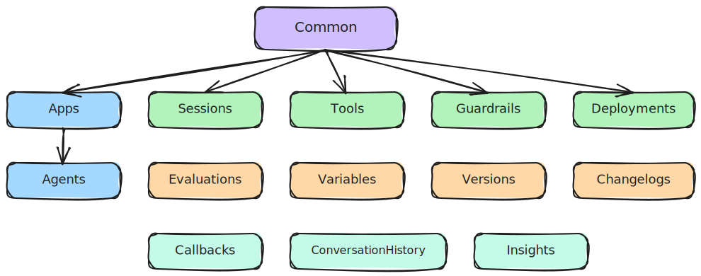

# API Reference

Welcome! This section is your complete reference for everything `cxas_scrapi` exposes. Whether you are writing a quick script or building a full automation pipeline, you'll find every class, method, and parameter documented here.

The library is organized into four main areas:

- **Core** — the primary building blocks for interacting with CX Agent Studio resources (apps, agents, sessions, tools, and more).
- **Evals** — evaluation runners for tools, simulations, callbacks, and guardrails.
- **Utils** — helpers for loading eval files, linting agent repos, working with Secret Manager and Google Sheets, and processing changelogs.
- **Migration** — visualization and dependency tools to help you understand and migrate Dialogflow CX (DFCX) agents to CX Agent Studio.

## Class Hierarchy

Every core class ultimately inherits from `Common`, which takes care of authentication and shared GCP utilities for you.

<figure class="diagram" markdown>
  
  <figcaption>Class inheritance hierarchy — all core classes inherit from Common, which handles authentication.</figcaption>
</figure>

## All Classes at a Glance

### Core

| Class | Description |
|---|---|
| [`Common`][cxas_scrapi.core.common.Common] | Authentication base — all other classes inherit from this. |
| [`Apps`](core/apps.md) | List, create, update, delete, import, and export CXAS apps. |
| [`Agents`](core/agents.md) | Manage LLM, DFCX, and workflow agents within an app. |
| [`Sessions`](core/sessions.md) | Send text or audio turns to a CXAS session and parse the response. |
| [`Tools`](core/tools.md) | Manage tool and toolset definitions; execute tools directly. |
| [`Guardrails`](core/guardrails.md) | Create and manage content safety guardrails. |
| [`Deployments`](core/deployments.md) | Manage app deployments and deployment configurations. |
| [`Evaluations`](core/evaluations.md) | List, run, export, and manage golden and scenario evaluations. |
| [`Variables`](core/variables.md) | Manage app-level session variable definitions and defaults. |
| [`Versions`](core/versions.md) | Create and restore app version snapshots. |
| [`Changelogs`](core/changelogs.md) | Read the audit changelog for an app. |
| [`Callbacks`](core/callbacks.md) | Manage before/after model, agent, and tool Python callbacks. |
| [`ConversationHistory`](core/conversation-history.md) | Browse and retrieve recorded conversation logs. |
| [`Insights`](core/insights.md) | CCAI Insights API operations including scorecard management. |

### Evals

| Class | Description |
|---|---|
| [`ToolEvals`](evals/tool-evals.md) | Run unit tests for individual tools from YAML test files. |
| [`SimulationEvals`](evals/simulation-evals.md) | AI-driven end-to-end conversation simulations using Gemini. |
| [`CallbackEvals`](evals/callback-evals.md) | Run pytest-based tests for agent Python callbacks. |
| [`GuardrailEvals`](evals/guardrail-evals.md) | Test guardrail behavior and responses. |

### Utils

| Class | Description |
|---|---|
| [`EvalUtils`](utils/eval-utils.md) | Load, convert, and export evaluation YAML files. |
| [Linter](utils/linter.md) | Rule-based lint engine for validating CXAS agent repos. |
| [`SecretManagerUtils`](utils/secret-manager.md) | Create and retrieve GCP Secret Manager secrets. |
| [`ChangelogUtils`](utils/changelog-utils.md) | Helpers for parsing and formatting app changelogs. |
| [`GoogleSheetsUtils`](utils/google-sheets.md) | Read and write data to Google Sheets. |

### Migration

| Classes | Description |
|---|---|
| [Migration Tools](migration/index.md) | Visualize DFCX flows and playbooks; resolve dependencies for migration. |
