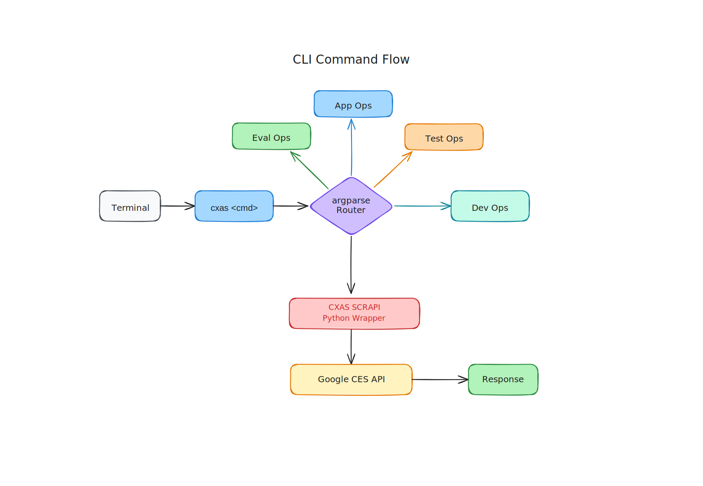

# CLI Reference

The `cxas` CLI puts the full power of CX Agent Studio in your terminal — you can pull apps, push changes, run evaluations, lint your configs, spin up GitHub Actions, and a whole lot more, all without touching the Cloud Console.

<figure class="diagram"></figure>

## Global Options

These options apply to every `cxas` command:

| Option | Required | Default | Description |
|--------|----------|---------|-------------|
| `--oauth-token TOKEN` | No | — | OAuth bearer token for authenticating with the CES API. If omitted, the CLI falls back to `CXAS_OAUTH_TOKEN` and then to Application Default Credentials. |

## Environment Variables

| Variable | Description |
|----------|-------------|
| `CXAS_OAUTH_TOKEN` | OAuth bearer token. Set this instead of passing `--oauth-token` on every command. |
| `GOOGLE_APPLICATION_CREDENTIALS` | Path to a service account key file. Used as a fallback when no OAuth token is present, following standard Google Cloud ADC behaviour. |

## Resource Identifier Format

Most commands that target a specific app accept either a **full resource name** or a **display name**. The full resource name follows this pattern:

```
projects/{project}/locations/{location}/apps/{app}
```

For example:

```
projects/my-gcp-project/locations/us-central1/apps/my-agent-app
```

When you pass a display name (e.g., `"My Support Agent"`) instead of a resource name, you also need to provide `--project-id` and `--location` so the CLI can look it up.

## Commands

| Command | Description |
|---------|-------------|
| [`cxas pull`](pull.md) | Export an app from CX Agent Studio to a local directory. |
| [`cxas push`](push.md) | Upload a local agent directory back to CX Agent Studio. |
| [`cxas create`](create.md) | Create a brand-new app in CX Agent Studio. |
| [`cxas delete`](delete.md) | Permanently delete an app. |
| [`cxas branch`](branch.md) | Clone an existing app into a new one (pull → create → push). |
| [`cxas apps`](apps.md) | List all apps or get details about a specific one. |
| [`cxas export`](export.md) | Export an evaluation definition to a YAML or JSON file. |
| [`cxas push-eval`](push-eval.md) | Upload evaluation definitions from a YAML file to an app. |
| [`cxas run`](run.md) | Trigger evaluations and optionally wait for results. |
| [`cxas test-tools`](test-tools.md) | Run unit tests against your agent's tools. |
| [`cxas test-callbacks`](test-callbacks.md) | Run unit tests for all callbacks in an app directory. |
| [`cxas test-single-callback`](test-single-callback.md) | Run unit tests for a single, specific callback. |
| [`cxas ci-test`](ci-test.md) | Run the full CI test lifecycle against a temporary app. |
| [`cxas local-test`](local-test.md) | Run the CI test lifecycle inside a local Docker container. |
| [`cxas init-github-action`](init-github-action.md) | Generate a GitHub Actions workflow file for your agent. |
| [`cxas lint`](lint.md) | Lint your app directory for best-practice violations. |
| [`cxas init`](init.md) | Bootstrap a project with AI agent development skills. |
| [`cxas insights`](insights.md) | Manage QA scorecards via the Insights API. |
