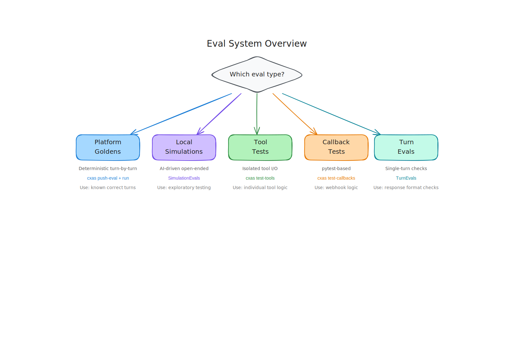

# Testing & Evaluation

Testing a conversational agent is different from testing a traditional software system. The agent's behavior is probabilistic — the same input can produce slightly different outputs on different runs. A robust evaluation strategy tests deterministic behavior where it exists, and measures quality where it doesn't.

SCRAPI provides five complementary evaluation types, each targeting a different layer of your agent.

<figure class="diagram"></figure>

---

## The five evaluation types

| Type | What it tests | Where it runs | Format |
|------|--------------|---------------|--------|
| **Platform Goldens** | Deterministic turn-by-turn responses and tool calls | CX Agent Studio platform | YAML with `conversations:` key |
| **Local Simulations** | Open-ended conversation goals over multiple turns | Local machine using Sessions API | YAML with `evals:` key |
| **Tool Tests** | Isolated tool inputs and outputs with assertions | Local machine | YAML with `tests:` key |
| **Callback Tests** | Python unit tests for callback code | Local machine (pytest) | pytest files |
| **Turn Evals** | Single-turn response assertions | Local machine using Sessions API | Python code |

---

## Choosing the right eval type

Use this decision table to pick the right eval for what you're testing:

```
Is the behavior deterministic (same input → exact same output)?
├── YES → Can you test it as a tool in isolation?
│         ├── YES → Tool Tests
│         └── NO  → Platform Goldens (turn-by-turn assertions)
└── NO  → Is this a multi-turn conversation goal?
          ├── YES → Local Simulations
          └── NO  → Turn Evals (single-turn quality checks)

Is the behavior in a Python callback?
└── YES → Callback Tests (pytest)
```

In practice, you'll use multiple types together. A well-tested agent typically has:

- **Tool tests** for every tool — fast, isolated, run in seconds
- **Platform goldens** for key happy-path conversations — verifies the full agent loop
- **Local simulations** for complex multi-step scenarios where exact responses vary
- **Callback tests** for any non-trivial callback logic

---

## Quick comparison by use case

**"I want to test that my tool returns the right data"**
: Use [Tool Tests](tool-tests.md). They call the tool directly and assert on specific fields in the response.

**"I want to test that the agent says the right thing in a specific conversation"**
: Use [Platform Goldens](platform-goldens.md). You script the exact conversation and the expected responses.

**"I want to test that the agent can *complete a task* without caring about exact phrasing"**
: Use [Local Simulations](local-simulations.md). You define a goal and success criteria; Gemini plays the user and judges whether the goal was met.

**"I want to test that my callback code is correct before deploying it"**
: Use [Callback Tests](callback-tests.md). They're just pytest — you can mock the platform objects and test your logic in isolation.

**"I want to quickly verify a single agent response meets a condition"**
: Use [Turn Evals](turn-evals.md). They're the most lightweight option for single-turn assertions.

---

## What's in this section

`Platform Goldens`
:   YAML format, pushing evals to the platform, running them with `cxas run --wait`, and interpreting results.

`Local Simulations`
:   YAML format, the `SimulationEvals` class, parallel execution, and audio modality support.

`Tool Tests`
:   YAML format with operator assertions, the `ToolEvals` class, and `cxas test-tools`.

`Callback Tests`
:   Directory structure, pytest integration, the `CallbackEvals` class, and `cxas test-callbacks`.

`Turn Evals`
:   The `TurnEvals` class, the `TurnOperator` enum, and single-turn code examples.

`Running Evaluations`
:   End-to-end CLI workflow, `cxas ci-test`, exit codes for CI, and combining multiple eval types.
